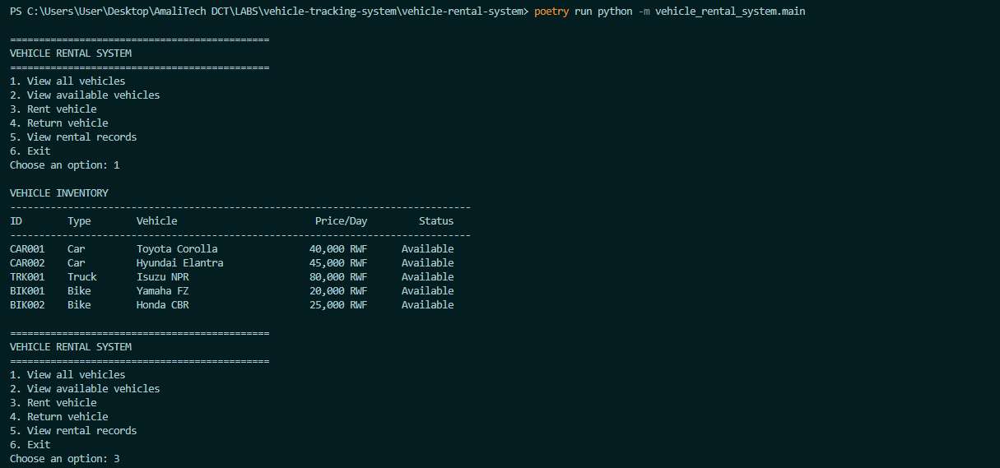
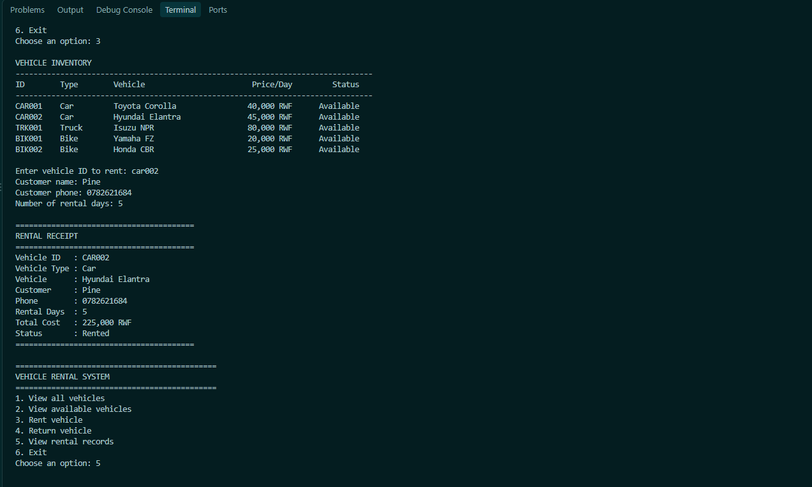
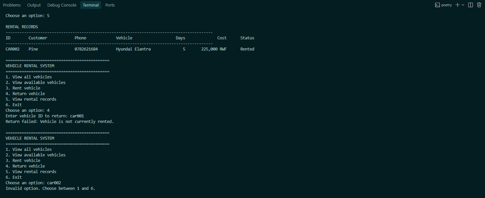
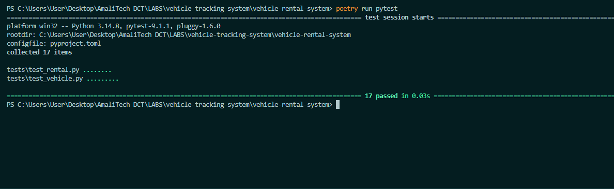
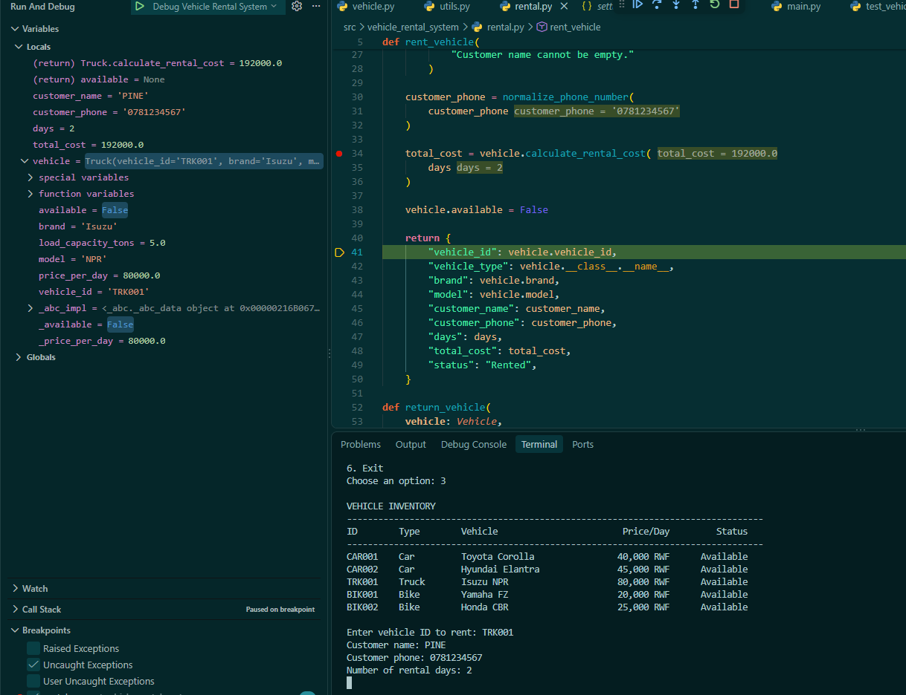

# Vehicle Rental System

A command-line **Vehicle Rental System** developed as part of the **AmaliTech Apprenticeship Program – Python Basics Module**.

The application allows users to view available vehicles, rent cars, trucks, and bikes, return rented vehicles, and track rental records together with customer information.

The project demonstrates Python fundamentals including data structures, functions, modular programming, object-oriented programming, inheritance, abstraction, encapsulation, polymorphism, property decorators, validation, exception handling, testing, and debugging.

---

## Features

The system allows users to:

- View all registered vehicles
- View only available vehicles
- Rent a vehicle
- Return a rented vehicle
- Store customer name and phone number with a rental
- Calculate rental costs dynamically
- Display rental receipts
- View rental records
- Track vehicle availability
- Validate rental prices and vehicle-specific information
- Prevent already-rented vehicles from being rented again
- Prevent available vehicles from being returned
- Validate customer phone numbers
- Run automated tests with `pytest`

---

## Supported Vehicle Types

The system currently supports:

1. Cars
2. Trucks
3. Bikes

Each vehicle type implements its own rental cost calculation.

---

## Python Concepts Demonstrated

This project demonstrates:

- Variables and data types
- Arithmetic operations
- Conditional statements
- `for` loops
- `while` loops
- Lists
- Dictionaries
- List comprehensions
- Functions
- Modules and imports
- Type hints
- Exception handling
- Abstract Base Classes
- Abstract methods
- Inheritance
- Encapsulation
- Polymorphism
- Method overriding
- Property decorators
- Property setters
- `super()`
- `__str__`
- `__repr__`
- State management
- Automated testing
- Debugging with breakpoints

---

## Project Structure

```text
vehicle-rental-system/
│
├── .vscode/
│   └── launch.json
│
├── docs/
│   └── images/
│       ├── app-menu.png
│       ├── rental-output.png
│       ├── rental-records.png
│       ├── tests-passing.png
│       └── debugger-view.png
│
├── src/
│   └── vehicle_rental_system/
│       ├── __init__.py
│       ├── vehicle.py
│       ├── rental.py
│       ├── utils.py
│       └── main.py
│
├── tests/
│   ├── __init__.py
│   ├── test_vehicle.py
│   └── test_rental.py
│
├── .gitignore
├── pyproject.toml
├── poetry.lock
└── README.md
```

---

# Setup Instructions

## 1. Prerequisites

Before running the application, make sure the following are installed:

- Python 3.11 or later
- Poetry
- Git
- VS Code, PyCharm, or another Python IDE

Check your Python installation:

```bash
python --version
```

or on Windows:

```bash
py --version
```

Check Poetry:

```bash
poetry --version
```

---

## 2. Clone the Repository

Clone the GitHub repository:

```bash
git clone https://github.com/B-Pine/vehicle-rental-system.git
```

Move into the project directory:

```bash
cd vehicle-rental-system
```

---

## 3. Install Dependencies

The project uses **Poetry** for dependency and virtual environment management.

Install the project and its dependencies:

```bash
poetry install
```

You can inspect the Poetry virtual environment using:

```bash
poetry env info
```

---

## 4. Run the Application

From the project root, run:

```bash
poetry run python -m vehicle_rental_system.main
```

The application menu will appear:

```text
=============================================
VEHICLE RENTAL SYSTEM
=============================================
1. View all vehicles
2. View available vehicles
3. Rent vehicle
4. Return vehicle
5. View rental records
6. Exit

Choose an option:
```

---

## 5. Run Automated Tests

The project uses `pytest`.

Run all tests using:

```bash
poetry run pytest
```

A successful run should show all tests passing.

Example:

```text
15 passed
```

The exact number may increase as more tests are added.

---

# Rental Cost Rules

The pricing formulas used in this project are simplified rules designed to demonstrate Python programming concepts.

They are not intended to represent real commercial vehicle rental pricing.

---

## Car

Cars use a basic daily-rate calculation:

```text
Rental Cost = Price Per Day × Number of Days
```

Example:

```text
Price Per Day = 40,000 RWF
Rental Days   = 3

Rental Cost = 40,000 × 3
            = 120,000 RWF
```

---

## Truck

Trucks include a 20% heavy-vehicle surcharge.

First:

```text
Base Cost = Price Per Day × Number of Days
```

Then:

```text
Surcharge = Base Cost × 20%
```

Finally:

```text
Total Cost = Base Cost + Surcharge
```

Example:

```text
Price Per Day = 80,000 RWF
Days          = 2

Base Cost = 160,000 RWF

Surcharge = 32,000 RWF

Total Cost = 192,000 RWF
```

---

## Bike

Bikes use the normal daily rate:

```text
Rental Cost = Price Per Day × Number of Days
```

For rentals of seven days or more, a 10% discount is applied.

Example:

```text
Price Per Day = 20,000 RWF
Days          = 7

Original Cost = 140,000 RWF

Discount = 14,000 RWF

Final Cost = 126,000 RWF
```

---

# Validation and Error Handling

The application validates several types of information.

Examples include:

- Vehicle ID cannot be empty
- Brand cannot be empty
- Model cannot be empty
- Rental price must be greater than zero
- Number of seats must be greater than zero
- Truck load capacity must be greater than zero
- Bike engine capacity must be greater than zero
- Rental days must be greater than zero
- Customer name cannot be empty
- Customer phone number must be valid
- Already-rented vehicles cannot be rented again
- Available vehicles cannot be returned
- Invalid menu choices are handled
- Invalid numeric input is handled

`ValueError` is used where invalid values are passed into business logic.

The CLI catches errors where necessary to prevent the application from terminating unexpectedly.

---

# Screenshots

## Application Main Menu



---

## Rental Receipt



---

## Rental Records and error handling



---

## Automated Tests



---

# Debugging Demonstration

VS Code debugging was used to inspect the rental process during execution.

A breakpoint was placed inside the `rent_vehicle()` function before rental cost calculation:

```python
total_cost = vehicle.calculate_rental_cost(days)
```

The debugger was used to inspect:

- Vehicle object
- Vehicle type
- Price per day
- Customer name
- Customer phone
- Rental duration
- Calculated rental cost
- Availability state

After stepping through the rental process, the debugger was also used to observe the availability state changing from:

```python
True
```

to:

```python
False
```

after a successful rental.



---

# Testing

Automated tests are stored inside:

```text
tests/
```

The tests verify behavior including:

- Car rental cost
- Truck rental surcharge
- Bike rental cost
- Bike long-term discount
- Price validation
- Car seat validation
- Truck load capacity validation
- Bike engine capacity validation
- Vehicle ID normalization
- Vehicle availability changes
- Vehicle return behavior
- Prevention of duplicate rentals
- Prevention of invalid returns
- Available vehicle filtering
- Customer information storage
- Customer phone validation

Run the tests using:

```bash
poetry run pytest
```

---

# Current Limitations

This application was created to demonstrate Python fundamentals and therefore intentionally uses a simplified rental model.

Current limitations include:

- Vehicle and rental data are stored only in memory.
- All rental data is lost when the application closes.
- Only one current rental record is stored per vehicle ID.
- There is no permanent customer database.
- Rental dates are not currently recorded.
- Late-return fees are not implemented.
- Vehicle maintenance tracking is not implemented.
- Authentication and user roles are not implemented.
- Pricing rules are simplified for learning purposes.

A future version could introduce persistent storage using JSON, SQLite, or a database such as PostgreSQL.

---

# Development Environment

The project was developed using:

- Python 3.11+
- Poetry
- Visual Studio Code
- Git
- GitHub
- pytest
- pytest-cov

---

# AI Usage

I intentionally used ChatGPT rather than Claude Code for this small project, using AI as a learning and review assistant so I could understand each part before adding it to the codebase. This allowed me to understand and explain the implementation instead of having an agent generate the entire project at once.

---

# Author

Developed as part of the **AmaliTech Apprenticeship Program – Python Basics Module**.